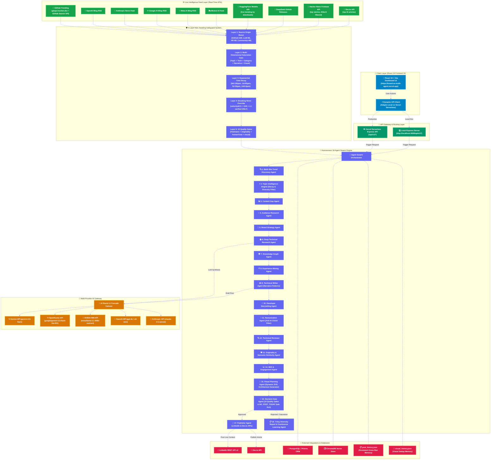
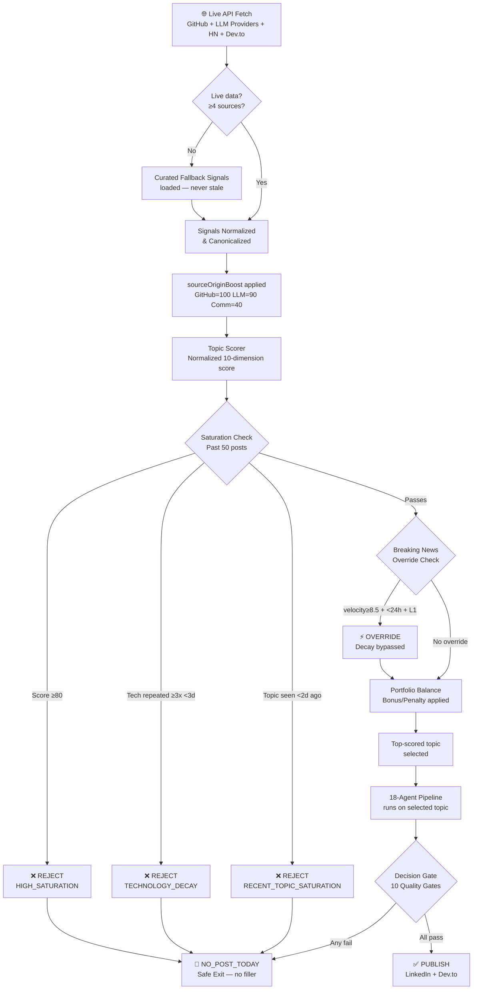

# Personal Brand OS

> **Autonomous Multi-Agent AI Platform for Daily Technical Content Intelligence, Live GitHub Trending & Official LLM Provider Monitoring, Dynamic Architecture Visuals & Selective Personal Brand Automation (LinkedIn + Dev.to)**

[](https://brand-os-multi-agent.vercel.app)
[](https://github.com/dineshkumar-mb/Brand-os-multi-agent)
[](https://www.typescriptlang.org/)
[](https://react.dev/)
[](https://github.com/dineshkumar-mb/Brand-os-multi-agent)

Personal Brand OS is an enterprise-grade autonomous multi-agent platform designed for Staff Engineers, Tech Leaders, and Software Architects. It automatically discovers **live, real-time trending topics** from GitHub's daily trending repositories, official AI lab release feeds (OpenAI, Anthropic, Google, Meta, Mistral, DeepSeek, HuggingFace), Hacker News, and Dev.to — then applies a mandatory **Technical Credibility Gate**, **Weighted 7-Dimension Scoring System**, **STAR + Human Engineering Storytelling**, **Visual RAG Pattern Retrieval**, **14–30 Day Visual Diversity Memory**, and **multi-layer quality safeguards** to guarantee only authentic, senior-level, evidence-backed content reaches publication.

---

## 🚀 Key Features & Architectural Capabilities

### 1. 🛡️ Mandatory Technical Credibility Gate & 7-Dimension Scoring System

The system enforces strict technical credibility logic to eliminate AI-generated fluff and unsupported claims:

- **Evidence First**: Identifies actual code, repository, benchmark, architecture, PR, issue, deployment log, experiment, or implementation behind every post. If no evidence exists, present topic as `EXPLORED_RESEARCH` rather than personally built or benchmarked.
- **Strict 4-Category Taxonomy**: Never merges **Fact** (docs/specifications), **Experience** (actually implemented), **Experiment** (actually measured), and **Opinion** (architectural interpretation).
- **Prohibited Invented Context**: Zero tolerance for invented context like `"our engineering team"`, `"production deployments"`, `"microservices"`, `"event buses"`, `"RPC"`, `"distributed state"`, `"circuit breakers"` when not supported by project context.
- **Benchmark Claims Protocol**: `"I benchmarked X"` requires dataset/workload, baseline, environment, methodology, metric, result; missing items trigger rewrite to `"I explored X"`.
- **First-Person Claims Proof Gate**: Flags `"I built"`, `"I implemented"`, `"I benchmarked"`, `"I optimized"`, `"I discovered"`, `"our team"`, `"we deployed"` when unsupported.
- **"Can I defend this in an interview?" Test**: Rejects claims that cannot be defended in a senior technical interview.
- **7-Dimension Weighted Scoring System**:
  - `Evidence / Authenticity`: **30%**
  - `Technical Accuracy`: **20%**
  - `Personal Experience`: **15%**
  - `Engineering Depth`: **15%**
  - `Storytelling`: **10%**
  - `Recruiter Value`: **5%**
  - `Engagement Potential`: **5%**
- **Hard Rule Enforcement**: If $\text{Evidence / Authenticity} < 70$, the post is **immediately REJECTED** regardless of total score (Publishing threshold $\ge 80/100$).

---

### 2. 📖 STAR + Human Engineering Storytelling Pipeline

The daily writing pipeline generates authentic, human engineering stories using the **STAR framework** internally as reasoning architecture without ever exposing formulaic headers:

```text
S = Situation   (Context, stakes, trigger)
T = Task        (Engineering objective & hard constraints)
A = Action      (Approaches considered, chosen approach, decision moment, trade-offs)
R = Result      (Outcome, telemetry evidence, senior insight, when not to use)
```

- **Two-Stage Content Generation**:
  - **Stage 1 (Engineering Reasoning Agent)**: Generates structured `STARStory` JSON containing context, decision moments, failure recovery paths, telemetry metrics, and senior trade-offs.
  - **Stage 2 (Senior Technical Writer Agent)**: Consumes `STARStory` and transforms it into natural engineering prose following the assigned `FormatStyle` and `StoryMode`.
- **Zero Rigid Formatting**: Strictly prohibits literal headers (`"Situation:"`, `"Task:"`) and emoji bullet step numbers (`1️⃣ Observation:`, `2️⃣ Problem:`...).
- **10 Rotated Story Modes**: `FAILURE_STORY`, `DECISION_STORY`, `DEBUGGING_STORY`, `PERFORMANCE_STORY`, `ARCHITECTURE_STORY`, `BUILD_IN_PUBLIC`, `TECH_DISCOVERY`, `CONTRARIAN_OBSERVATION`, `BEFORE_AFTER`, `PRODUCTION_REALITY`.
- **7 Rotated Format Styles**: `NARRATIVE_PARAGRAPHS`, `MINIMAL_BULLETS`, `BEFORE_AFTER_LAYOUT`, `SHORT_DIALOGUE`, `TECHNICAL_NOTE`, `STORY_FIRST`, `ARCHITECTURE_FIRST`.
- **7-Day Pattern Exclusion Memory**: Rotates story modes, format layouts, hook structures, and CTAs across 7 consecutive days to guarantee structural variety.
- **Boredom & Story Quality Evaluators**: Evaluates structural, hook, vocabulary, topic, CTA repetition, predictability, and genericness (`BoredomScore`). Automatically rejects content exceeding boredom threshold (> 35).

---

### 2. 🎨 Visual Intelligence Agent & Visual RAG Knowledge Store

To prevent repetitive images (e.g. dark backgrounds, generic AI robots, laptop illustrations), the platform features an independent **Visual Intelligence Agent** (`VisualIntelligenceAgent`) backed by a **Visual RAG Knowledge Store**:

```text
ContentOpportunity → STAR Story → Visual Intelligence Agent → Visual RAG Retrieval → Visual Pattern Extraction → 14-30 Day Visual Memory Check → Dynamic Format Rotation → Structured Prompt → Platform Blueprinting → Visual Review Agent → Decision Gate
```

- **Visual RAG Knowledge Store (`VisualRAGStore`)**:
  - Retrieves structural visual metadata (`VISUAL_METADATA`: composition, diagram layout, information density, visual purpose, color strategy) from high-performing technical posts (OpenAI, Anthropic, Google AI, Netflix Tech Blog, Uber Engineering, AWS Architecture).
  - **No Copyrighted Artwork Stored**: Stores design pattern references, not artwork or images.
- **Visual Pattern Extractor**:
  - Dynamically extracts composition (11 layouts: centered, split-screen, left/right, pipeline, layered architecture, flowchart, timeline, before/after, etc.), visual type (20 dynamic formats), information density (minimal, medium, high), and visual purpose.
- **14–30 Day Visual Diversity Memory (`RecentVisualMemoryStore`)**:
  - Stores past visual metadata (`visual_memory.json`). Computes `VisualRepetitionScore`.
  - Automatically triggers format and color palette rotation if repetition score exceeds 35.
- **Visual + STAR Story Alignment Engine**:
  - Evaluates `VisualStoryAlignmentScore` (0–100) ensuring representation of Situation, Task, Action, and Result (minimum 80% alignment required).
- **Color & Layout Strategy Rotation**:
  - Rotates across light technical blueprint, dark contrast, monochrome architecture, neutral documentation, green terminal, warm editorial, and high-contrast diagram styles.
- **Anti-AI Cliché Enforcement**:
  - Enforces strict negative prompts prohibiting generic robots, humanoids, floating glowing brains, and futuristic city stock imagery.
- **Platform-Differentiated Visuals**:
  - **LinkedIn**: Mobile-first, immediate hook clarity, high-contrast readable diagram nodes.
  - **Dev.to**: Deep technical documentation blueprint with code and state relationships.
- **Visual Review Agent (`VisualReviewAgent`)**:
  - Audits visual quality across 11 criteria and enforces rejection/regeneration gates (`VisualStoryAlignmentScore >= 80`, `VisualRepetitionScore <= 35`, `VisualQualityScore >= 85`).

---

### 3. 🌐 Live Intelligence Feed Engine (Real-Time, No Static Data)

Every pipeline run fetches **live data** from seven concurrent source categories:

| Source | Feed | Authority |
|:---|:---|:---|
| **GitHub Trending** | [`ghapi.huchen.dev`](https://ghapi.huchen.dev) daily repos → GitHub Search API fallback | 🔴 LEVEL_1_PRIMARY |
| **OpenAI** | `openai.com/blog/rss/` | 🔴 LEVEL_1_PRIMARY |
| **Google AI** | `blog.google/technology/ai/rss/` | 🔴 LEVEL_1_PRIMARY |
| **Meta AI** | `ai.meta.com/blog/rss/` | 🔴 LEVEL_1_PRIMARY |
| **Mistral AI** | `mistral.ai/feed.xml` | 🔴 LEVEL_1_PRIMARY |
| **HuggingFace** | `huggingface.co/api/models?sort=downloads` (live trending models) | 🔴 LEVEL_1_PRIMARY |
| **DeepSeek** | GitHub Releases API (`deepseek-ai/DeepSeek-V3`) | 🔴 LEVEL_1_PRIMARY |
| **Hacker News** | Firebase Realtime API (top stories, AI/tech filtered) | 🟡 LEVEL_3_COMMUNITY |
| **Dev.to** | `dev.to/api/articles?tag=ai` (live) | 🟡 LEVEL_3_COMMUNITY |

All sources run **concurrently** with `Promise.allSettled()` — individual source failures are isolated and never break the pipeline. If a live feed is unavailable, curated fallback signals supplement without reuse.

---

### 2. 🛡️ Trending Safeguard System — How Non-Trending Posts Are Blocked

The platform implements **five independent layers** of trending enforcement. A post must pass **all five** before it is approved for publication:

#### Layer 1 — Source Origin Scoring Boost
```
GitHub Trending (live)        → sourceOriginBoost = 100 (max priority)
Official LLM Provider RSS     → sourceOriginBoost = 90
HuggingFace Trending Models   → sourceOriginBoost = 80
Community (HN, Reddit, Dev.to)→ sourceOriginBoost = 40
```
Topics not grounded in live trending sources receive a **60-point scoring penalty** vs GitHub-sourced topics. The `sourceOriginBoost` dimension contributes **3% of the total topic score**, meaning a non-trending source can be outranked by any live feed signal with equivalent freshness.

#### Layer 2 — Multi-Dimensional Saturation Gate
```typescript
// topic-intelligence.ts — evaluateTopics()
if (minDaysAgoTopic < 2.0 && recentTopicMatches > 0)     → REJECT (RECENT_TOPIC_SATURATION)
if (recentFwMatches >= 3 && minDaysAgoFw < 3.0)           → REJECT (TECHNOLOGY_DECAY)
if (overallSaturationScore >= 80)                          → REJECT (HIGH_SATURATION_SCORE)
```
Five saturation dimensions are tracked per candidate topic:
- **Topic Saturation** — title/semantic Jaccard similarity vs past 50 posts
- **Technology Saturation** — framework/library repetition detection
- **Category Saturation** — category overuse in past 7 days
- **Narrative Saturation** — story angle repetition detection
- **Visual Saturation** — architecture diagram concept deduplication

#### Layer 3 — Exponential Time Decay Penalty
```
0 days ago → 100 penalty  (topic effectively blocked)
1 day ago  → 95 penalty
2 days ago → 90 penalty
3 days ago → 80 penalty
4 days ago → 65 penalty
5 days ago → 50 penalty
7 days ago → 30 penalty
14+ days   →  0 penalty  (topic fully eligible)
```
Every topic referenced in the post history receives a decay penalty in the formula:
$$\text{AdjustedScore} = \text{BaseScore} - (\text{SaturationScore} \times 0.5) + \text{PortfolioBalancingBonus}$$

#### Layer 4 — Breaking News Override Gate (Controlled Exception)
The only path for an already-seen topic to bypass the decay gate is **all three** of:
- `trend_velocity >= 8.5` (top decile of velocity scores)
- `publishedAt < 24h ago` (verified fresh from Level 1 source)
- `references.length > 0` (has URL-backed evidence)

Verified breaking news events (e.g. a new Claude or Gemini release confirmed by official RSS) bypass decay — everything else is blocked.

#### Layer 5 — Decision Gate (10 Quality Gates)
The final gate before `PUBLISH` evaluates:
```
topicFreshness ≥ 60    ✓
originality    ≥ 65    ✓  (Jaccard similarity < 0.35 vs past posts)
humanTone      = 100   ✓  (0 AI clichés remaining)
visualAlignment ≥ 80  ✓  (diagram nodes match article keywords)
careerSignal   ≥ 75    ✓
```
If any gate fails → `NO_POST_TODAY` safe exit. The pipeline never manufactures content from a non-trending source to fill the schedule.

---

### 3. 🧠 Normalized Scoring Formula (Updated v2)

$$\text{FinalScore} = 0.17 \times \text{Freshness} + 0.15 \times \text{Velocity} + 0.14 \times \text{TechnicalImportance} + 0.13 \times \text{CareerRelevance} + 0.10 \times \text{PersonalExperience} + 0.09 \times \text{ContentGap} + 0.08 \times \text{Originality} + 0.06 \times \text{AudienceInterest} + 0.05 \times \text{SourceAuthority} + 0.03 \times \text{SourceOriginBoost}$$

> **SourceOriginBoost** is the new dimension (v2) that explicitly rewards topics sourced from live GitHub Trending and official LLM provider releases.

---

### 4. 📅 Persistent Post & Visual History (Cross-Run Memory)
- **`post_history.json`**: All published posts are persisted to disk. Decay penalty and saturation scores are calculated against this full history on every run — even after process restarts. This is the core fix for the "same post repeated for 5 days" problem.
- **`visual_history.json`**: All generated architecture diagram concepts are stored. The Visual Planning Agent checks semantic similarity against the last 7 diagrams before generating a new one, ensuring visual variety every day.

---

### 5. 🤖 Human Tone & Anti-AI Cliché Sanitization
- **35+ AI Cliché Regex Filters**: Automatically strips *"in today's fast-paced world"*, *"let's dive in"*, *"game-changing"*, *"harness the power"*, *"paradigm shift"*, *"rich tapestry"*, *"synergy"*, *"supercharge"*, and 27 more.
- **Authentic Engineering Narrative Attribution**: Clear labeling of *"Direct Production Build Experience"* vs *"Technical Research & Benchmarking"*.
- **8 Rotated Narrative Structures**: Cycles through `ENGINEERING_DISCOVERY`, `UNEXPECTED_PROBLEM`, `TECHNICAL_TRADEOFF`, `PRODUCTION_FAILURE`, `CONTRARIAN_OBSERVATION`, `NEW_TECHNOLOGY_ANALYSIS`, `BUILD_IN_PUBLIC`, `ARCHITECTURE_LESSON`.

---

### 6. 🎨 Dynamic Context-Aware Architecture Visuals
- **Topic-Tailored SVG Diagrams**: Generates dynamic vector flow diagrams matching the topic domain (DeepSeek RL Pipelines, TypeScript 5.7 Compiler AST, Docker Buildx Hardening, ClickHouse Columnar Analytics, eBPF Zero-Trust Security).
- **Visual Concept Deduplication**: Remembers the last 7 diagram concepts to prevent visual repetition.
- **Semantic Text-Visual Alignment Gate (≥ 80%)**: Verifies diagram node labels against article keywords before publishing.

---

### 7. 📊 7-Day Observability & Telemetry Report
Structured daily logs (`[TREND_SCAN]`, `[TOPIC_FILTER]`, `[VISUAL_FILTER]`, `[DECISION_GATE]`) with explainable decisions for every approved, rejected, and bypassed topic.

---

## 📐 System Architecture Diagram



---

## 🛡️ Non-Trending Topic Safeguard — Decision Flow



---

## 🌐 Dynamic API Endpoints Reference

The platform features **dynamic dual-environment API routing**:
- **Production (Vercel):** `https://brand-os-multi-agent.vercel.app/api/v1`
- **Local Development:** `http://localhost:4000/api/v1`

### 🔑 Authentication & Profile Endpoints
| Method | Endpoint | Description |
| :--- | :--- | :--- |
| `POST` | `/api/v1/auth/login` | Authenticate user and issue JWT token |
| `GET` | `/api/v1/auth/me` | Fetch active user profile and permissions |

### 🤖 Multi-Agent Swarm & Intelligence Endpoints
| Method | Endpoint | Description |
| :--- | :--- | :--- |
| `GET` | `/api/v1/agents/status` | Get real-time status of all 18 autonomous swarm agents |
| `POST` | `/api/v1/agents/trigger` | Trigger full end-to-end multi-agent execution pipeline |
| `GET` | `/api/v1/trends` | Fetch latest discovered topics with live trend velocity scores |
| `POST` | `/api/v1/trends/scan` | Trigger live scan across GitHub trending, official LLM labs, forums |
| `POST` | `/api/v1/research` | Conduct deep technical research on a given topic |

### 🧠 Multi-Provider AI Gateway Endpoints
| Method | Endpoint | Description |
| :--- | :--- | :--- |
| `GET` | `/api/v1/gateway/benchmarks` | Retrieve model performance, token usage, latency, and costs |
| `GET` | `/api/v1/gateway/logs` | Fetch AI Gateway execution and failover logs |
| `POST` | `/api/v1/gateway/execute` | Execute custom prompt with auto-routing (Gemini, OpenRouter, NVIDIA NIM, OpenAI, Anthropic) |
| `POST` | `/api/v1/chat` | Server-Sent Events (SSE) stream for AI Copilot chat assistant |

### 📄 Content Generation & Social Media Publishing Endpoints
| Method | Endpoint | Description |
| :--- | :--- | :--- |
| `GET` | `/api/v1/posts` | List generated LinkedIn post payloads, hooks, and slide outlines |
| `GET` | `/api/v1/articles` | List generated Dev.to technical article markdown drafts |
| `POST` | `/api/v1/publish` | Dispatch post payload to LinkedIn REST API or Dev.to API |
| `POST` | `/api/v1/schedule` | Schedule post for future publication via BullMQ queue |
| `GET` | `/api/v1/jobs` | Monitor status of background publishing jobs |

### 📊 Diversity Report, Analytics & System Health
| Method | Endpoint | Description |
| :--- | :--- | :--- |
| `GET` | `/api/v1/diversity-report` | Fetch 7-Day Category & Technology Distribution Report |
| `GET` | `/api/v1/dashboard` | Summary dashboard KPIs (views, CTR, follower growth, active agents) |
| `GET` | `/api/v1/analytics` | Deep post performance metrics and learning feedback loop telemetry |
| `GET` | `/health` | System health check endpoint |
| `GET` | `/metrics` | Prometheus metrics telemetry export |

---

## 🏛️ Enterprise Monorepo Folder Structure

```text
personal-brand-os/
├── api/                        # Vercel Serverless Function API Entry Point
│   └── index.ts
│
├── client/                     # React 19 + Vite Frontend SaaS Application
│   ├── src/                    # Components, Pages, and REST/SSE Services
│   ├── index.html
│   └── vite.config.ts
│
├── server/                     # Express API Server Gateway
│   ├── src/                    # Controllers, Middleware, Routes, SSE Engine
│   └── package.json
│
├── worker/                     # Background Service Job Processor & Swarm Loop
│   └── src/main.ts
│
├── tests/                      # 5-Consecutive-Day Simulation Test Suite
│   └── 5-consecutive-dry-runs.test.ts
│
├── packages/                   # Core Shared Domain Libraries
│   ├── shared/                 # Zod Validation Schemas, Enums, TypeScript Types
│   ├── database/               # Prisma Schema, Database Client, and Seeding Script
│   ├── ai-gateway/             # Multi-Provider Router (Gemini, OpenRouter, NVIDIA NIM, OpenAI, Anthropic)
│   ├── mcp-client/             # MCP Tool Bindings (GitHub, Reddit, RSS, Search, Browser)
│   ├── plugins/                # Plugin Marketplace Registry (Dev.to, Hashnode, Slack)
│   ├── agents/                 # Autonomous 18-Agent Swarm Engine & Event Bus
│   │   └── src/agents/
│   │       ├── trend-discovery.ts      # Live GitHub + LLM provider signal discovery
│   │       ├── topic-intelligence.ts   # 5-layer trending safeguard engine
│   │       └── visual-planning.ts      # Dynamic SVG generation + visual deduplication
│   ├── intelligence/           # Real-Time Intelligence Scan Engine
│   │   └── src/
│   │       ├── sources/
│   │       │   ├── open-source/github.ts       # Live GitHub Trending API
│   │       │   ├── official/labs.ts             # Live LLM Provider RSS Feeds
│   │       │   ├── model-hubs/hubs.ts           # Live HuggingFace + Ollama APIs
│   │       │   └── communities/discussions.ts   # Live HN Firebase + Dev.to APIs
│   │       └── ranking/
│   │           └── topic-scorer.ts     # Scoring with sourceOriginBoost (GitHub/LLM priority)
│   ├── publisher/              # Social Media Adapters (LinkedIn REST API, Dev.to API)
│   ├── scheduler/              # BullMQ Cron Job Scheduler
│   └── analytics/              # Metric Aggregator, post_history.json, visual_history.json
│
├── post_history.json           # Persistent cross-run post memory (prevents repetition)
├── visual_history.json         # Persistent cross-run visual memory (prevents visual loops)
├── docker/                     # Production Container Configurations
├── docs/                       # Architecture Specs & Setup Guides
├── vercel.json                 # Vercel Deployment & Serverless Rewrite Config
└── package.json                # Root Workspace Scripts
```

---

## 🚀 Quick Start — How to Run Locally

### 1. Prerequisites
- **Node.js**: `v20.0.0` or higher
- **Package Manager**: `pnpm` (recommended) or `npm`
- **Docker Desktop**: Optional (required if using local PostgreSQL, Redis, ChromaDB)

### 2. Install Workspace Dependencies
```bash
pnpm install
```

### 3. Configure Environment Variables
Copy `.env.example` to `.env` in the root directory:
```bash
cp .env.example .env
```
Fill in your credentials:
```env
# AI Providers
OPENROUTER_API_KEY=your_openrouter_key
NVIDIA_NIM_API_KEY=your_nim_key
OPENAI_API_KEY=your_openai_key
ANTHROPIC_API_KEY=your_anthropic_key
GEMINI_API_KEY=your_gemini_key

# Social Publishing
LINKEDIN_ACCESS_TOKEN=your_linkedin_token
DEVTO_API_KEY=your_devto_key

# Live Intelligence (optional — increases GitHub API rate limit from 60 to 5000 req/hr)
GITHUB_TOKEN=your_github_pat
HUGGINGFACE_TOKEN=your_hf_token
```

> **`GITHUB_TOKEN`** and **`HUGGINGFACE_TOKEN`** are optional but strongly recommended. Without them the GitHub Search API is limited to 60 requests/hour and HuggingFace to public model access only. The trending feed will still work via `ghapi.huchen.dev` as the primary source.

### 4. Run TypeScript Typecheck & Test Suite
```bash
npx pnpm typecheck
npx pnpm test
```

### 5. Start Development Servers
Runs the Web Dashboard (`http://localhost:3000`), Backend API (`http://localhost:4000`), and Background Worker concurrently:
```bash
npm run dev
```

---

## 🛠️ Workspace CLI Commands Reference

| Category | Command | Description |
| :--- | :--- | :--- |
| **Development** | `npm run dev` | Runs **Web UI**, **API Gateway**, and **Worker** concurrently |
| **Development** | `npm run dev:web` | Starts only the **React 19 + Vite Frontend** (`http://localhost:3000`) |
| **Development** | `npm run dev:api` | Starts only the **Express Backend API** (`http://localhost:4000`) |
| **Development** | `npm run dev:worker` | Starts only the **Background Worker** swarm service |
| **Build & Quality**| `npm run build` | Builds production bundles for all 15 workspace packages |
| **Build & Quality**| `npm run typecheck` | Runs TypeScript type checking across all workspace packages |
| **Build & Quality**| `npm run test` | Runs Vitest unit, integration, and 5-consecutive-day simulation tests |
| **Database** | `npm run db:generate` | Generates Prisma Client types from database schema |
| **Database** | `npm run db:push` | Pushes Prisma schema changes directly to the PostgreSQL database |
| **Docker** | `npm run docker:up` | Starts local database and queue containers (`docker-compose up -d`) |
| **Docker** | `npm run docker:down` | Stops local database and queue containers (`docker-compose down`) |

---

## 📚 Complete Documentation Links
- [Local Setup & Running Guide](docs/LOCAL_SETUP.md)
- [Architecture Specifications](docs/ARCHITECTURE.md)
- [AI Gateway Documentation](docs/AI_GATEWAY.md)
- [MCP Integration Specs](docs/MCP_INTEGRATION.md)
- [Agent Specifications](docs/AGENT_SPEC.md)

---

## 📋 Changelog

### v3.5 — Technical Credibility Gate & 7-Dimension Weighted Scoring System (Aug 2026)
- **NEW**: **Mandatory Technical Credibility Gate** enforcing Evidence First verification and interview defense test (`TechnicalReviewerAgent`).
- **NEW**: **7-Dimension Weighted Scoring System** matrix: Evidence/Authenticity (30%), Technical Accuracy (20%), Personal Experience (15%), Engineering Depth (15%), Storytelling (10%), Recruiter Value (5%), Engagement Potential (5%).
- **NEW**: **Hard Rejection Threshold Rule**: If Evidence / Authenticity $< 70$, post is **immediately REJECTED** regardless of total score (Publishing threshold $\ge 80/100$).
- **NEW**: **Benchmark Claims Protocol**: `"I benchmarked X"` requires dataset, baseline, environment, methodology, metric, and result. Missing elements trigger auto-rewrite to `"I explored X"`.
- **NEW**: **Prohibited Synthetic Context Filter**: Strips invented context (`"our engineering team"`, `"production deployments"`, `"microservices"`, `"event buses"`, `"RPC"`) when unsupported by code context.
- **NEW**: **Exploratory Research Mode**: Replaces synthetic experience fallback in `ExperienceMiningAgent` with `EXPLORED_RESEARCH` mode when no matching project log exists.
- **NEW**: Comprehensive unit test suite in `credibility-gate.test.ts` (100% test pass rate across 43 unit tests).

### v3.0 — STAR Storytelling Pipeline & Visual RAG Intelligence (Aug 2026)
- **NEW**: Two-stage **STAR + Human Engineering Storytelling Pipeline** (`EngineeringReasoningAgent` + `TechnicalWriterAgent`).
- **NEW**: 10 `StoryModes` and 7 `FormatStyles` with strict anti-formulaic rules (no literal headers `"Situation:"` or rigid emoji numbers `1️⃣`).
- **NEW**: 7-Day Pattern Exclusion Memory for story angles, format layouts, hooks, and CTAs (`WritingMemoryTracker`).
- **NEW**: `BoredomScore` & `StoryQualityScore` evaluators rejecting post repetition (> 35 boredom threshold).
- **NEW**: Independent **Visual Intelligence Agent** (`VisualIntelligenceAgent`) and **Visual Quality Review Agent** (`VisualReviewAgent`).
- **NEW**: **Visual RAG Knowledge Store** (`VisualRAGStore`) retrieving structural visual metadata (`VISUAL_METADATA`) from top engineering publications (OpenAI, Anthropic, Google, Netflix, Uber, AWS).
- **NEW**: **14–30 Day Visual Diversity Memory** (`RecentVisualMemoryStore`) with automatic format/color strategy rotation when `VisualRepetitionScore > 35`.
- **NEW**: `VisualStoryAlignmentScore` (0–100) guaranteeing visual representation of Situation, Task, Action, and Result (>= 80% alignment required).
- **NEW**: Platform-differentiated image blueprinting (LinkedIn mobile-first vs Dev.to deep architecture).
- **NEW**: Anti-AI Cliché Enforcement rejecting stock robots, humanoids, glowing brains, and futuristic city art.
- **NEW**: 10-day dry run verification suite with 100% test pass rate across 38 unit & integration tests.

### v2.0 — Live Intelligence & Trending Safeguards (Aug 2026)
- **NEW**: All 4 source collectors upgraded to live APIs — no more static hardcoded data
- **NEW**: `sourceOriginBoost` scoring dimension — GitHub Trending=100, Official LLM=90, HF=80, Community=40
- **NEW**: 7 concurrent official LLM provider RSS/API feeds with per-source isolation (`Promise.allSettled`)
- **NEW**: Live HuggingFace Trending Models API + Ollama Popular Models API
- **NEW**: Live Hacker News Firebase top stories with AI/tech keyword filtering
- **NEW**: Live Dev.to top AI articles via REST API
- **NEW**: `post_history.json` and `visual_history.json` — persistent cross-run memory to prevent same-post repetition even after restarts
- **NEW**: Expanded framework/category mapping for GPT-4o, Claude 3.7/4, Gemini 2.5, Llama 4, Qwen, Rust, Go, K8s, etc.
- **FIX**: Root cause of "same post for 5 days" resolved — history was being lost on process restart

### v1.0 — Initial Platform Launch
- 18-agent swarm pipeline with multi-source intelligence scanning
- LinkedIn + Dev.to publishing with image upload support
- Dynamic SVG architecture diagram generation
- Exponential time decay saturation filtering
