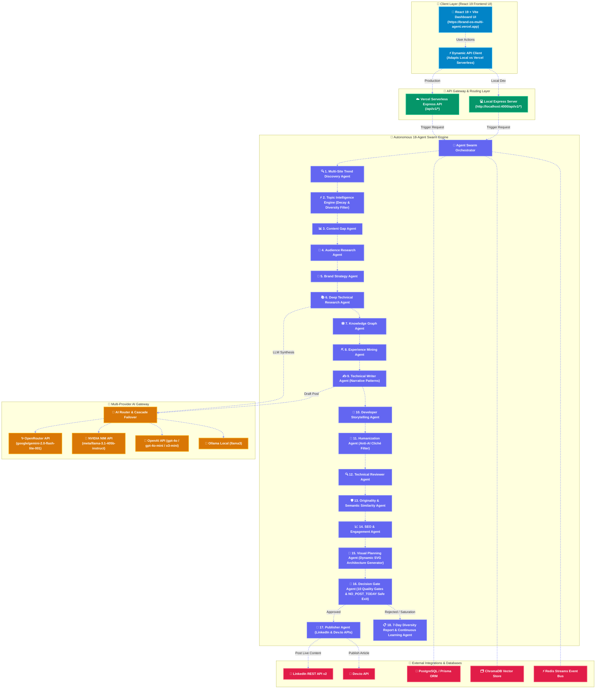

# Personal Brand OS

> **Autonomous Multi-Agent AI Platform for Daily Technical Content Intelligence, Dynamic Architecture Visuals & Selective Personal Brand Automation (LinkedIn + Dev.to)**

[](https://brand-os-multi-agent.vercel.app)
[](https://github.com/dineshkumar-mb/Brand-os-multi-agent)
[](https://www.typescriptlang.org/)
[](https://react.dev/)

Personal Brand OS is an enterprise-grade autonomous multi-agent platform designed for Staff Engineers, Tech Leaders, and Software Architects. It automatically discovers verified technical topics across official AI labs (OpenAI, Anthropic, DeepSeek, Google), open-source GitHub repositories, developer tools, and engineering forums. 

The platform applies **exponential time decay**, **multi-dimensional saturation filtering**, **normalized scoring**, **authentic humanization filters**, and **dynamic SVG architecture diagram generation** to output non-repetitive, high-authority LinkedIn posts and Dev.to technical articles every day.

---

## 🚀 Key Features & Architectural Capabilities

### 1. 🧠 Daily Content Intelligence & Topic Diversity Engine
- **Multi-Source Signal Scanner**: Discovers 20–50 candidate topics daily across Official AI Labs, Open Source Repositories, Developer Platforms, and Community Engineering Discussions.
- **Normalized Configurable Scoring Formula**:
  $$\text{FinalScore} = 0.18 \times \text{Freshness} + 0.15 \times \text{Velocity} + 0.14 \times \text{TechnicalImportance} + 0.14 \times \text{CareerRelevance} + 0.10 \times \text{PersonalExperience} + 0.10 \times \text{ContentGap} + 0.08 \times \text{Originality} + 0.06 \times \text{AudienceInterest} + 0.05 \times \text{SourceAuthority}$$
- **Exponential Time Decay**: Penalizes recently published topics ($0\text{d} \rightarrow 100$, $1\text{d} \rightarrow 95$, $2\text{d} \rightarrow 90$, $3\text{d} \rightarrow 80$, $4\text{d} \rightarrow 65$, $5\text{d} \rightarrow 50$, $7\text{d} \rightarrow 30$, $14+\text{d} \rightarrow 0$).
- **Multi-Dimensional Saturation**: Tracks Topic, Technology, Category, Narrative, and Visual saturation to eliminate topic loops (e.g. repeated Redis/MCP posts).
- **7-Day Category Portfolio Balancing**: Applies $0.80$ portfolio penalty if the category was published within the past 48h.
- **Breaking News Override**: Bypasses decay ONLY when verified by a Level 1 primary source, $<24\text{h}$ old, with high velocity ($>8.5$).
- **Autonomous `NO_POST_TODAY` Safe Exit**: Exits cleanly when no topic meets quality standards without manufacturing generic AI filler content.

### 2. 🤖 Human Tone & Anti-AI Cliché Sanitization
- **35+ AI Cliché Regex Filters**: Automatically strips out AI buzzwords like *"in today's fast-paced world"*, *"let's dive in"*, *"game-changing"*, *"harness the power"*, *"paradigm shift"*, *"rich tapestry"*, *"synergy"*, and *"supercharge"*.
- **Authentic Engineering Narrative Attribution**: Clear labeling distinguishing *"Direct Production Build Experience"* vs *"Technical Research & Benchmarking"*.
- **8 Rotated Narrative Structures**: Automatically cycles narrative angles (`ENGINEERING_DISCOVERY`, `UNEXPECTED_PROBLEM`, `TECHNICAL_TRADEOFF`, `PRODUCTION_FAILURE`, `CONTRARIAN_OBSERVATION`, `NEW_TECHNOLOGY_ANALYSIS`, `BUILD_IN_PUBLIC`, `ARCHITECTURE_LESSON`).

### 3. 🎨 Dynamic Context-Aware Architecture Visuals
- **Topic-Tailored SVG Diagrams**: Generates dynamic vector flow diagrams matching topic domain (DeepSeek RL Pipelines, TypeScript 5.7 Compiler AST, Docker Buildx Hardening, ClickHouse Columnar Analytics, eBPF Zero-Trust Security).
- **Visual Concept History Tracking**: Remembers past diagram structures to prevent visual repetition across consecutive days.
- **Semantic Text-Visual Alignment Gate ($\ge 80\%$)**: Verifies diagram node labels against article keywords before publishing.

### 4. 📊 7-Day Observability & Telemetry Report
- Generates structured daily logs (`[TREND_SCAN]`, `[TOPIC_FILTER]`, `[VISUAL_FILTER]`, `[DECISION_GATE]`) and outputs a 7-Day Daily Content Intelligence & Diversity Report detailing category distribution, repeated tech, top fresh candidates, and decision explainability.

---

## 📐 System Architecture Diagram



---

## 🌐 Dynamic API Endpoints Reference

The platform features **dynamic dual-environment API routing**:
- **Production (Vercel):** `https://brand-os-multi-agent.vercel.app/api/v1`
- **Local Development:** `http://localhost:4000/api/v1`

### 🔑 Authentication & Profile Endpoints
| Method | Endpoint | Description |
| :--- | :--- | :--- |
| `POST` | `/api/v1/auth/login` | Authenticate user and issue JWT token |
| `GET` | `/api/v1/auth/me` | Fetch active user profile and permissions |

### 🤖 Multi-Agent Swarm & Intelligence Endpoints
| Method | Endpoint | Description |
| :--- | :--- | :--- |
| `GET` | `/api/v1/agents/status` | Get real-time status of all 18 autonomous swarm agents |
| `POST` | `/api/v1/agents/trigger` | Trigger full end-to-end multi-agent execution pipeline |
| `GET` | `/api/v1/trends` | Fetch latest discovered technical topics and trend velocity scores |
| `POST` | `/api/v1/trends/scan` | Trigger live scan across official labs, GitHub, forums, and developer platforms |
| `POST` | `/api/v1/research` | Conduct deep technical research on a given topic |

### 🧠 Multi-Provider AI Gateway Endpoints
| Method | Endpoint | Description |
| :--- | :--- | :--- |
| `GET` | `/api/v1/gateway/benchmarks` | Retrieve model performance, token usage, latency, and costs |
| `GET` | `/api/v1/gateway/logs` | Fetch AI Gateway execution and failover logs |
| `POST` | `/api/v1/gateway/execute` | Execute custom prompt with auto-routing (OpenRouter, NVIDIA NIM, OpenAI) |
| `POST` | `/api/v1/chat` | Server-Sent Events (SSE) stream for AI Copilot chat assistant |

### 📄 Content Generation & Social Media Publishing Endpoints
| Method | Endpoint | Description |
| :--- | :--- | :--- |
| `GET` | `/api/v1/posts` | List generated LinkedIn post payloads, hooks, and slide outlines |
| `GET` | `/api/v1/articles` | List generated Dev.to technical article markdown drafts |
| `POST` | `/api/v1/publish` | Dispatch post payload to LinkedIn REST API or Dev.to API |
| `POST` | `/api/v1/schedule` | Schedule post for future publication via BullMQ queue |
| `GET` | `/api/v1/jobs` | Monitor status of background publishing jobs |

### 📊 Diversity Report, Analytics & System Health
| Method | Endpoint | Description |
| :--- | :--- | :--- |
| `GET` | `/api/v1/diversity-report` | Fetch 7-Day Category & Technology Distribution Report |
| `GET` | `/api/v1/dashboard` | Summary dashboard KPIs (views, CTR, follower growth, active agents) |
| `GET` | `/api/v1/analytics` | Deep post performance metrics and learning feedback loop telemetry |
| `GET` | `/health` | System health check endpoint |
| `GET` | `/metrics` | Prometheus metrics telemetry export |

---

## 🏛️ Enterprise Monorepo Folder Structure

```text
personal-brand-os/
├── api/                        # Vercel Serverless Function API Entry Point
│   └── index.ts
│
├── client/                     # React 19 + Vite Frontend SaaS Application
│   ├── src/                    # Components, Pages, and REST/SSE Services
│   ├── index.html
│   └── vite.config.ts
│
├── server/                     # Express API Server Gateway
│   ├── src/                    # Controllers, Middleware, Routes, SSE Engine
│   └── package.json
│
├── worker/                     # Background Service Job Processor & Swarm Loop
│   └── src/main.ts
│
├── tests/                      # 5-Consecutive-Day Simulation Test Suite
│   └── 5-consecutive-dry-runs.test.ts
│
├── packages/                   # Core Shared Domain Libraries
│   ├── shared/                 # Zod Validation Schemas, Enums, TypeScript Types
│   ├── database/               # Prisma Schema, Database Client, and Seeding Script
│   ├── ai-gateway/             # Multi-Provider Router (OpenRouter, NVIDIA NIM, OpenAI)
│   ├── mcp-client/             # MCP Tool Bindings (GitHub, Reddit, RSS, Search, Browser)
│   ├── plugins/                # Plugin Marketplace Registry (Dev.to, Hashnode, Slack)
│   ├── agents/                 # Autonomous 18-Agent Swarm Engine & Event Bus
│   ├── publisher/              # Social Media Adapters (LinkedIn REST API, Dev.to API)
│   ├── scheduler/              # BullMQ Cron Job Scheduler
│   └── analytics/              # Metric Aggregator & 7-Day Content Memory
│
├── docker/                     # Production Container Configurations
├── docs/                       # Architecture Specs & Setup Guides
├── vercel.json                 # Vercel Deployment & Serverless Rewrite Config
└── package.json                # Root Workspace Scripts
```

---

## 🚀 Quick Start — How to Run Locally

### 1. Prerequisites
- **Node.js**: `v20.0.0` or higher
- **Package Manager**: `pnpm` (recommended) or `npm`
- **Docker Desktop**: Optional (required if using local PostgreSQL, Redis, ChromaDB)

### 2. Install Workspace Dependencies
```bash
pnpm install
```

### 3. Configure Environment Variables
Copy `.env.example` to `.env` in the root directory:
```bash
cp .env.example .env
```
Fill in your credentials in `.env` (`OPENROUTER_API_KEY`, `NVIDIA_NIM_API_KEY`, `OPENAI_API_KEY`, `LINKEDIN_ACCESS_TOKEN`, `DEVTO_API_KEY`).

### 4. Run TypeScript Typecheck & Test Suite
```bash
npx pnpm typecheck
npx pnpm test
```

### 5. Start Development Servers
Runs the Web Dashboard (`http://localhost:3000`), Backend API (`http://localhost:4000`), and Background Worker concurrently:
```bash
npm run dev
```

---

## 🛠️ Workspace CLI Commands Reference

| Category | Command | Description |
| :--- | :--- | :--- |
| **Development** | `npm run dev` | Runs **Web UI**, **API Gateway**, and **Worker** concurrently |
| **Development** | `npm run dev:web` | Starts only the **React 19 + Vite Frontend** (`http://localhost:3000`) |
| **Development** | `npm run dev:api` | Starts only the **Express Backend API** (`http://localhost:4000`) |
| **Development** | `npm run dev:worker` | Starts only the **Background Worker** swarm service |
| **Build & Quality**| `npm run build` | Builds production bundles for all 15 workspace packages |
| **Build & Quality**| `npm run typecheck` | Runs TypeScript type checking across all workspace packages |
| **Build & Quality**| `npm run test` | Runs Vitest unit, integration, and 5-consecutive-day simulation tests |
| **Database** | `npm run db:generate` | Generates Prisma Client types from database schema |
| **Database** | `npm run db:push` | Pushes Prisma schema changes directly to the PostgreSQL database |
| **Docker** | `npm run docker:up` | Starts local database and queue containers (`docker-compose up -d`) |
| **Docker** | `npm run docker:down` | Stops local database and queue containers (`docker-compose down`) |

---

## 📚 Complete Documentation Links
- [Local Setup & Running Guide](docs/LOCAL_SETUP.md)
- [Architecture Specifications](docs/ARCHITECTURE.md)
- [AI Gateway Documentation](docs/AI_GATEWAY.md)
- [MCP Integration Specs](docs/MCP_INTEGRATION.md)
- [Agent Specifications](docs/AGENT_SPEC.md)
