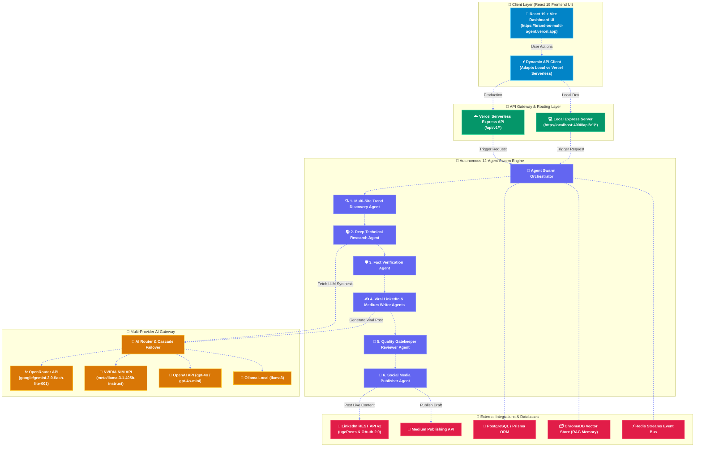

# Personal Brand OS

> **Autonomous Multi-Agent AI Platform for Personal Brand Growth (LinkedIn + Medium)**

[](https://brand-os-multi-agent.vercel.app)
[](https://github.com/dineshkumar-mb/Brand-os-multi-agent)
[](https://www.typescriptlang.org/)
[](https://react.dev/)

Personal Brand OS is an enterprise-grade autonomous multi-agent platform designed for Staff Engineers, Tech Leaders, and Content Creators. It automatically discovers trending technical topics across GitHub, Reddit, and RSS feeds, performs deep research with fact-verification, learns the user's style via vector RAG, generates viral LinkedIn posts and Medium technical articles, schedules content, tracks engagement analytics, and automatically feeds performance data back into a self-improving agentic feedback loop.

---

## 📐 System Architecture Diagram



---

## 🌐 Dynamic API Endpoints Reference

The platform features **dynamic dual-environment API routing**:
- **Production (Vercel):** `https://brand-os-multi-agent.vercel.app/api/v1`
- **Local Development:** `http://localhost:4000/api/v1`

### 🔑 Authentication & Profile Endpoints
| Method | Endpoint | Description |
| :--- | :--- | :--- |
| `POST` | `/api/v1/auth/login` | Authenticate user and issue JWT token |
| `GET` | `/api/v1/auth/me` | Fetch active user profile and permissions |

### 🤖 Multi-Agent Swarm & Research Endpoints
| Method | Endpoint | Description |
| :--- | :--- | :--- |
| `GET` | `/api/v1/agents/status` | Get real-time status of all 12 autonomous swarm agents |
| `POST` | `/api/v1/agents/trigger` | Trigger full end-to-end multi-agent execution pipeline |
| `GET` | `/api/v1/trends` | Fetch latest discovered technical topics and trend velocity scores |
| `POST` | `/api/v1/trends/scan` | Trigger live scan across GitHub, Reddit, and RSS feeds |
| `POST` | `/api/v1/research` | Conduct deep technical research on a given topic |

### 🧠 Multi-Provider AI Gateway Endpoints
| Method | Endpoint | Description |
| :--- | :--- | :--- |
| `GET` | `/api/v1/gateway/benchmarks` | Retrieve model performance, token usage, latency, and costs |
| `GET` | `/api/v1/gateway/logs` | Fetch AI Gateway execution and failover logs |
| `POST` | `/api/v1/gateway/execute` | Execute custom prompt with auto-routing (OpenRouter, NVIDIA NIM, OpenAI) |
| `POST` | `/api/v1/chat` | Server-Sent Events (SSE) stream for AI Copilot chat assistant |

### 📄 Content Generation & Social Media Publishing Endpoints
| Method | Endpoint | Description |
| :--- | :--- | :--- |
| `GET` | `/api/v1/posts` | List generated LinkedIn post payloads, hooks, and slide outlines |
| `GET` | `/api/v1/articles` | List generated Medium technical article markdown drafts |
| `POST` | `/api/v1/publish` | Dispatch post payload to LinkedIn REST API or Medium API |
| `POST` | `/api/v1/schedule` | Schedule post for future publication via BullMQ queue |
| `GET` | `/api/v1/jobs` | Monitor status of background publishing jobs |

### 📊 Analytics, Plugins & System Health
| Method | Endpoint | Description |
| :--- | :--- | :--- |
| `GET` | `/api/v1/dashboard` | Summary dashboard KPIs (views, CTR, follower growth, active agents) |
| `GET` | `/api/v1/analytics` | Deep post performance metrics and learning feedback loop telemetry |
| `GET` | `/api/v1/plugins` | List available marketplace plugins (Dev.to, Hashnode, Slack) |
| `POST` | `/api/v1/plugins/execute` | Execute third-party marketplace plugin action |
| `GET` | `/health` | System health check endpoint |
| `GET` | `/metrics` | Prometheus metrics telemetry export |

---

## 🏛️ Enterprise Monorepo Folder Structure

```text
personal-brand-os/
├── api/                        # Vercel Serverless Function API Entry Point
│   └── index.ts
│
├── client/                     # React 19 + Vite Frontend SaaS Application
│   ├── src/                    # Components, Pages, and REST/SSE Services
│   ├── index.html
│   └── vite.config.ts
│
├── server/                     # Express API Server Gateway
│   ├── src/                    # Controllers, Middleware, Routes, SSE Engine
│   └── package.json
│
├── worker/                     # Background Service Job Processor & Swarm Loop
│   └── src/main.ts
│
├── packages/                   # Core Shared Domain Libraries
│   ├── shared/                 # Zod Validation Schemas, Enums, TypeScript Types
│   ├── database/               # Prisma Schema, Database Client, and Seeding Script
│   ├── ai-gateway/             # Multi-Provider Router (OpenRouter, NVIDIA NIM, OpenAI)
│   ├── mcp-client/             # MCP Tool Bindings (GitHub, Reddit, RSS, Search, Browser)
│   ├── plugins/                # Plugin Marketplace Registry (Dev.to, Hashnode, Slack)
│   ├── agents/                 # Autonomous Multi-Agent Swarm & Redis Event Bus
│   ├── publisher/              # Social Media Adapters (LinkedIn REST API, Medium API)
│   ├── scheduler/              # BullMQ Cron Job Scheduler
│   └── analytics/              # Metric Aggregator & Learning Loop Feedback
│
├── docker/                     # Production Container Configurations
├── docs/                       # Architecture Specs & Setup Guides
├── vercel.json                 # Vercel Deployment & Serverless Rewrite Config
└── package.json                # Root Workspace Scripts
```

---

## 🚀 Quick Start — How to Run Locally

### 1. Prerequisites
- **Node.js**: `v20.0.0` or higher
- **Package Manager**: `pnpm` (recommended) or `npm`
- **Docker Desktop**: Optional (required if using local PostgreSQL, Redis, ChromaDB)

### 2. Install Workspace Dependencies
```bash
pnpm install
# or
npm install
```

### 3. Configure Environment Variables
Copy `.env.example` to `.env` in the root directory:
```bash
cp .env.example .env
```
Fill in your credentials in `.env` (e.g. `OPENROUTER_API_KEY`, `NVIDIA_NIM_API_KEY`, `LINKEDIN_CLIENT_ID`, `LINKEDIN_CLIENT_SECRET`, `LINKEDIN_ACCESS_TOKEN`).

### 4. Start Local Infrastructure Services (Optional)
To launch PostgreSQL, Redis, ChromaDB, and Neo4j containers locally via Docker:
```bash
npm run docker:up
```

### 5. Initialize & Seed Database
Generate Prisma Client, push schema, and populate demo data:
```bash
npm run db:generate
npm run db:push
npm run db:seed
```

### 6. Start Development Servers
Runs the Web Dashboard (`http://localhost:3000`), Backend API (`http://localhost:4000`), and Background Worker concurrently:
```bash
npm run dev
```

---

## 🛠️ Workspace CLI Commands Reference

All workspace scripts can be run from the root directory using `npm run <command>` or `pnpm <command>`:

| Category | Command | Description |
| :--- | :--- | :--- |
| **Development** | `npm run dev` | Runs **Web UI**, **API Gateway**, and **Worker** concurrently |
| **Development** | `npm run dev:web` | Starts only the **React 19 + Vite Frontend** (`http://localhost:3000`) |
| **Development** | `npm run dev:api` | Starts only the **Express Backend API** (`http://localhost:4000`) |
| **Development** | `npm run dev:worker` | Starts only the **Background Worker** swarm service |
| **Build & Quality**| `npm run build` | Builds production bundles for all workspace applications & packages |
| **Build & Quality**| `npm run typecheck` | Runs TypeScript type checking across all workspace packages |
| **Build & Quality**| `npm run test` | Runs unit & integration test suites using Vitest |
| **Database** | `npm run db:generate` | Generates Prisma Client types from database schema |
| **Database** | `npm run db:push` | Pushes Prisma schema changes directly to the PostgreSQL database |
| **Database** | `npm run db:seed` | Seeds the database with baseline admin, swarm agents, and benchmark data |
| **Docker** | `npm run docker:up` | Starts local database and queue containers (`docker-compose up -d`) |
| **Docker** | `npm run docker:down` | Stops local database and queue containers (`docker-compose down`) |

---

## 🐳 Running via Docker Compose (Full Container Stack)

To run the entire platform as fully containerized microservices without needing local Node.js:

```bash
# 1. Build and launch containers in background
docker-compose up --build -d

# 2. Access Web Dashboard UI
# Open: http://localhost:3000

# 3. Access Backend API Gateway Health Check
# Open: http://localhost:4000/health
```

---

## 📚 Complete Documentation Links
- [Local Setup & Running Guide](docs/LOCAL_SETUP.md)
- [Architecture Specifications](docs/ARCHITECTURE.md)
- [AI Gateway Documentation](docs/AI_GATEWAY.md)
- [MCP Integration Specs](docs/MCP_INTEGRATION.md)
- [Agent Specifications](docs/AGENT_SPEC.md)

